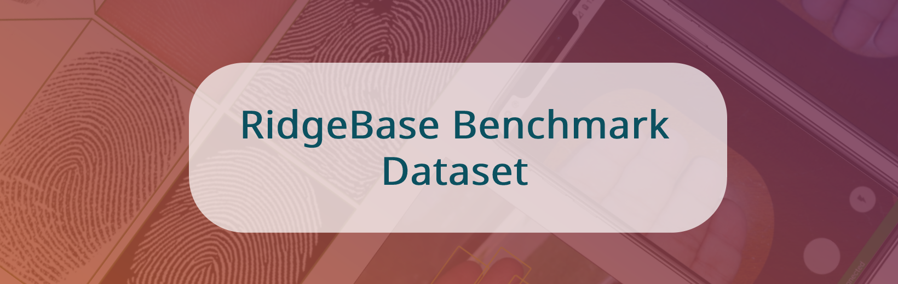

# RidgeBase: A Cross-Sensor Multi-Finger Contactless Fingerprint Dataset



> **Paper accepted in IJCB 2022.**

## **Download the dataset:**

To download the dataset for research please email the duly filled [license agreement](!agreement) to `bhavinja@buffalo.edu`. We will send the zip file and password after reviewing the request. 

**Unzip the dataset:**
```
unzip -P <password> RidgeBase.zip
```

For any queries please email: `bhavinja@buffalo` or `cubs@buffalo.edu`.

## **About the Dataset**

RidgeBase consists of more than 15,000 contactless and contact-based fingerprint image pairs acquired from 88 individuals under different background and lighting conditions using two smartphone cameras and one flatbed contact sensor. RidgeBase is designed to promote research under different matching scenarios that include Single Finger Matching and Multi-Finger Matching for both contactless-to-contactless (CL2CL) and contact-to-contactless (C2CL) verification and identification. 

RidgeBase dataset can be using for training and evaluating contactless fingerprint matching algorithms (CL2CL and C2CL) for three types of tasks:

1. **Task 1**: Single Finger Matching
2. **Task 2**: Four Finger Matching
3. **Task 3**: Set-Based Matching

# File Structure:

```
RidgeBase
├── README.md
├── Task1
│   ├── readme.md
│   ├── Test
│   │   ├── Contactbased
│   │   │   ├── 1_14493_Left_Index.bmp
│   │   │   ├── 1_14493_Left_Little.bmp
│   │   │   ├── ...
│   │   └── Contactless
│   │       ├── 1_Apple_14493_1_LEFT_image_fingerprintSMEG5K05_0.png
│   │       ├── 1_Apple_14493_1_LEFT_image_fingerprintSMEG5K05_1.png
│   │       ├── ...
│   └── Train
│       ├── Contactbased
│       │   ├── 10727
│       │   │   ├── 1_10727_Left_Index.bmp
│       │   │   ├── 1_10727_Left_Little.bmp
│       │   │   ├── ...
│       │   ├── ...
│       └── Contactless
│           ├── 1_Apple_10727_1_LEFT_image_fingerprint8GIFPDNU_0.8888496160507202_3.png
│           ├── 1_Apple_10727_1_LEFT_image_fingerprint8GIFPDNU_0.9363613128662109_1.png
│           ├── ...
├── Task2
│   ├── Test
│   │   ├── Contactbased
│   │   │   ├── 14493
│   │   │   │   ├── 1_14493_Left_Four_Fingers.bmp
│   │   │   │   ├── 1_14493_Left_Four_Fingers.wsq
│   │   │   │   ├── ...
│   │   │   ├── ...
│   │   └── Contactless
│   │       ├── 14493
│   │       │   ├── 1_Apple_14493_1_LEFT_image_fingerprintSMEG5K05.png
│   │       │   ├── 1_Apple_14493_1_LEFT_image_fingerprintW51LRC2S.png
│   │       ├── ...   
│   └── Train
│       ├── Contactbased
│       │   ├── 10727
│       │   │   ├── 1_10727_Left_Four_Fingers.bmp
│       │   │   ├── 1_10727_Left_Four_Fingers.wsq
│       │   ├── ...   
│       └── Contactless
│           ├── 10727
│           │   ├── 1_Apple_10727_1_LEFT_image_fingerprint8GIFPDNU.png
│           │   ├── 1_Apple_10727_1_RIGHT_image_fingerprintDAH28AVI.png
│           ├── ... 
└── Task3
    └── DistalMatching
        ├── set_based_test_c2cl.json
        └── set_based_test_cl2cl.json

255 directories, 21624 files

```

## Task Specific Details:
1. Task 1:

    **Contactbased:** `<SessionID>_<IdentityID>_<HandID>_<FingerID>`. 
    (Example: 1_14493_Left_Index)
    
    **Contactless:**
    `<SessionID>_<DeviceName>_<IdentityID>_<BackgroundID>_<HandID>_image_fingerprintRandomseq_<FingerID>`
    (Example: 1_Apple_14493_1_LEFT_image_fingerprintSMEG5K05_0.png)
    > Note: For contactless training files we also provide the confidence score of predicted bounding box used to segment the finger. 
    `<SessionID>_<DeviceName>_<IdentityID>_<BackgroundID>_<HandID>_image_fingerprintRandomseq_<Confidence>_<FingerID>`
    example: 1_Apple_10727_1_LEFT_image_fingerprint8GIFPDNU_0.8888496160507202_3.png

    **Background IDs:**    
    ```
    1: Indoor
    2: Outdoor
    3: White
    ```

2. Task 2:

    **Contactbased:** `<SessionID>_<IdentityID>_<HandID>_Four_Fingers`. 
    (Example: 1_14493_Left_Four_Fingers.wsq)
    
    **Contactless:**
    `<SessionID>_<DeviceName>_<IdentityID>_<BackgroundID>_<HandID>_image_fingerprintRandomseq`
    (Example: 1_Apple_14493_1_LEFT_image_fingerprintSMEG5K05.png)

    **Background IDs:**    
    ```
    1: Indoor
    2: Outdoor
    3: White
    ```
3. Task 3:

   Here we provide two JSON files which descibe the gallery and query sets for C2CL and CL2CL tasks for set based matching. 
   > <span style="color:red">Note:</span>: These mappings are for evaluation only. Training set pairs can be created from Task 1 training set. 

   File name conventions are same as Task 1. 

## Acknowledgement

This work was conducted at the Center for Unified Biometrics and Sensors (CUBS) at the University at Buffalo and was supported by the Center for Identification Technology Research (CITeR) and the National Science Foundation through grant #1822190.

# BibTex:

If you use RidgeBase dataset or the associated app in your research please cite following papers:

**Plain Text:**

> B. Jawade, D. Mohan, S. Setlur, N. Ratha and V. Govindaraju "RidgeBase: A Cross-Sensor Multi-Finger Contactless Fingerprint Dataset," 2022 IEEE International Joint Conference on Biometrics (IJCB), 2022

`
```
@book{jawade2022ridgebase,
 author = "B. Jawade and D. Mohan and S. Setlur and N. Ratha and V. Govindaraju",
 title = "RidgeBase: A Cross-Sensor Multi-Finger Contactless Fingerprint Dataset",
 publisher = "2022 {IEEE} International Joint Conference on Biometrics ({IJCB})",
 year = 2022
}
```

**Plain Text:**

> B. Jawade, A. Agarwal, S. Setlur and N. Ratha, "Multi Loss Fusion For Matching Smartphone Captured Contactless Finger Images," 2021 IEEE International Workshop on Information Forensics and Security (WIFS), 2021, pp. 1-6, doi:10.1109/WIFS53200.2021.9648393.

```
@INPROCEEDINGS{9648393, 
    author={Jawade, Bhavin and Agarwal, Akshay and Setlur, Srirangaraj and Ratha, Nalini},  
    booktitle={2021 IEEE International Workshop on Information Forensics and Security (WIFS)},   
    title={Multi Loss Fusion For Matching Smartphone Captured Contactless Finger Images},   
    year={2021},  
    volume={},  
    number={},  
    pages={1-6},  
    doi={10.1109/WIFS53200.2021.9648393}}
```
